# Wecovi POC 구현 Plan

## 목적

- 목적: TypeScript 정적 분석 결과를 WebStorm의 Flow Canvas에서 정확하게 탐색할 수 있는 POC를 완성한다.
- 문제: 현재 저장소에는 Gradle과 `plugin.xml` 골격만 있고 분석기, UI, 테스트 기반이 없다. 마일스톤만으로 바로 구현하면 한 Task의 범위가 커져 실패 원인을 빠르게 분리하기 어렵다.
- 방법: PSI 분석 결과를 정규화된 flow contract로 분리하고, Task마다 하나의 public behavior와 전용 TypeScript fixture를 추가해 짧은 자동 테스트로 판정한다. IDE/JCEF 통합만 최소 수동 smoke test를 병행한다.

## 범위

### POC 포함

- `@covi-root`, `@covi`, `@covi-group` 탐색
- 함수 호출, `new`, 인자, signature, `await`, `return`
- 내부·외부·미해결 호출 경계
- `if/else`, `switch`, `throw`, `try/catch`, 반복문
- 배열 리터럴 기반 `Promise.all`, 직접·간접 재귀
- interface 단일·다중·미구현 경계와 런타임 DI 경계
- Flows/Functions 목록, 읽기 전용 Flow Canvas, 노드 펼치기, 원본 코드 이동
- 별도 실제 NestJS 프로젝트의 대표 endpoint 검증

### POC 제외

- Inspector의 Covi 편집, 소스 저장과 Undo
- NestJS endpoint 자동 탐지
- 다중 구현체 후보를 사용자가 선택해 임시 flow로 여는 기능
- 동적으로 조합한 Promise와 실제 런타임 trace
- 사용자가 직접 노드를 배치·연결하는 graph editor
- 검색·필터·확대·축소·이력 등 핵심 판정에 필요하지 않은 편의 기능
- 영속 DB, 별도 API 서버와 localhost 통신

## 완료 원칙

1. 각 Task는 해당 Task의 targeted test가 통과하면 빠르게 완료 여부를 판정할 수 있어야 한다.
2. 잘못된 호출 연결은 0건이어야 한다. 확정하지 못한 호출은 원본 표현식과 명시적 boundary로 남긴다.
3. 분석 Task는 전용 fixture와 기대 `FlowDocument`를 비교한다.
4. UI Task는 고정 JSON fixture로 먼저 검증한 뒤 Kotlin bridge에 연결한다.
5. Task 완료 시 targeted test와 누적 회귀 테스트를 모두 실행한다.
6. M5 전까지 실제 NestJS 프로젝트를 자동 테스트의 필수 외부 의존성으로 만들지 않는다.

## 전체 작업 흐름

```mermaid
flowchart LR
  T01["T01 빌드·테스트 기반"] --> T02["T02 Flow contract"]
  T02 --> T03["T03 Covi 탐색"]
  T03 --> T04["T04 기본 본문 분석"]
  T04 --> T05["T05 호출 대상 경계"]
  T05 --> T06["T06 Flow service"]
  T02 --> T07["T07 IDE·JCEF shell"]
  T06 --> T08["T08 React 탐색 UI"]
  T07 --> T08
  T08 --> T09["T09 조건 분기"]
  T09 --> T10["T10 예외 흐름"]
  T10 --> T11["T11 반복문"]
  T11 --> T12["T12 Promise.all"]
  T12 --> T13["T13 재귀"]
  T13 --> T14["T14 interface 구현체"]
  T14 --> T15["T15 Runtime DI 경계"]
  T15 --> T16["T16 실제 NestJS 검증"]
```

## 설계

### 구성 요소

| 영역 | 제안 경로 | 책임 |
| --- | --- | --- |
| Flow contract | `src/main/kotlin/com/wecovi/plugin/model/` | PSI와 UI에 독립적인 index, node, source location, boundary DTO |
| Metadata index | `src/main/kotlin/com/wecovi/plugin/analysis/CoviMetadataIndexer.kt` | Covi JSDoc을 읽고 Flows/Functions 목록 생성 |
| Body analyzer | `src/main/kotlin/com/wecovi/plugin/analysis/TypeScriptFlowAnalyzer.kt` | 함수 본문을 소스 순서의 node tree로 변환 |
| Target resolver | `src/main/kotlin/com/wecovi/plugin/analysis/CallTargetResolver.kt` | internal, external, unresolved, multiple, runtime binding 판정 |
| Application service | `src/main/kotlin/com/wecovi/plugin/service/FlowService.kt` | 목록·root 분석·지연 펼치기 요청 조정 |
| IDE integration | `src/main/kotlin/com/wecovi/plugin/ui/` | Tool Window, Flow Editor, JCEF 생명주기, 소스 이동 |
| Bridge | `src/main/kotlin/com/wecovi/plugin/bridge/` | 허용한 typed message와 JSON 변환 |
| React UI | `ui/src/` | 중첩 Canvas, 펼치기와 source 이동 intent |
| Test fixtures | `src/test/testData/typescript/`, `fixtures/contracts/` | TypeScript 입력과 Kotlin/React 공용 기대 contract |

### 최소 Flow contract

- `FlowIndexEntry`: symbol ID, 제목, 함수명, group path(빈 값은 Kotlin 목록 UI에서 `Ungrouped`로 표시), source location, root 여부
- `FlowDocument`: root 정보와 소스 순서를 유지하는 최상위 node 목록
- `FlowNode`: 안정적인 node ID, kind, label, code expression, signature, source location, `isDocumented`, children, expandability
- `FlowNodeKind`: call, construct, await, return, condition, switch, throw, try, catch, loop, parallel, reference
- `BoundaryKind`: external, unresolved, multiple, recursive, runtime binding
- `SourceLocation`: project-relative path, start offset 또는 line/column

PSI 객체와 absolute path는 bridge contract에 직접 노출하지 않는다. Kotlin 내부에서 symbol pointer 또는 source location을 이용해 다시 찾는다.

### 최소 bridge message

| 방향 | type | 목적 |
| --- | --- | --- |
| React → Kotlin | `listFlows` | Flows 목록 요청 |
| React → Kotlin | `listFunctions` | Functions 목록 요청 |
| React → Kotlin | `analyzeFlow` | root의 상위 flow 요청 |
| React → Kotlin | `expandNode` | 선택한 내부 함수의 하위 flow 요청 |
| React → Kotlin | `openSource` | 허용된 source location을 IDE에서 열기 |
| Kotlin → React | `result` | requestId에 대응하는 성공 payload |
| Kotlin → React | `error` | 검증 실패 또는 분석 실패 |
| Kotlin → React | `flowChanged` | 저장된 소스 변경 후 현재 flow 재요청 알림 |

## 설계 결정

### 결정 1. PSI 분석과 UI 사이에 정규화 contract를 둔다

- 선택: Kotlin data class 기반 `FlowDocument`를 유일한 UI 입력으로 사용한다.
- 이유: PSI 없이 분석 결과를 snapshot으로 검증하고 React도 고정 JSON으로 독립 개발할 수 있다.
- 차선책: PSI를 순회하면서 바로 bridge JSON을 생성한다.
- 차선책 미채택 이유: 분석, 직렬화와 UI 표현이 결합돼 작은 변경도 IDE 통합 테스트가 필요해진다.
- tradeoff: PSI → contract 변환 코드와 Kotlin/TypeScript 타입 동기화 비용이 생긴다.

### 결정 2. 자동 테스트는 작은 TypeScript fixture와 구조 비교를 중심으로 한다

- 선택: Task별 fixture와 기대 node tree를 public behavior로 검증한다.
- 이유: 호출 순서와 boundary 오류를 몇 초 안에 재현하고 회귀 여부를 명확히 판정할 수 있다.
- 차선책: 매 Task마다 `runIde`에서 눈으로 확인한다.
- 차선책 미채택 이유: 느리고 반복하기 어려우며 잘못된 연결을 자동으로 탐지할 수 없다.
- tradeoff: JetBrains test fixture 초기 설정 비용이 필요하다.

### 결정 3. POC에서는 장기 분석 cache를 두지 않는다

- 선택: 목록·분석·펼치기 요청 시 저장된 PSI를 읽고, 저장 이벤트에는 현재 flow 재요청만 알린다.
- 이유: cache invalidation보다 정확성 검증에 집중하며 저장된 최신 코드가 자연스럽게 반영된다.
- 차선책: symbol dependency graph와 영향받는 flow cache를 먼저 구축한다.
- 차선책 미채택 이유: POC 성공 기준과 무관한 복잡성과 stale data 위험이 커진다.
- tradeoff: 큰 프로젝트에서는 반복 분석 비용이 커질 수 있으며 POC 이후 측정이 필요하다.

### 결정 4. UI는 contract fixture로 먼저 완성한 뒤 bridge에 연결한다

- 선택: React component test에서는 공용 JSON fixture를 사용하고 마지막에 Kotlin request handler를 연결한다.
- 이유: JCEF 문제와 UI rendering 문제를 분리해 실패 원인을 빠르게 찾을 수 있다.
- 차선책: 첫 UI Task부터 `runIde` 안에서만 개발한다.
- 차선책 미채택 이유: HMR과 component test를 활용하기 어렵고 feedback loop가 길어진다.
- tradeoff: bridge 연결 시 contract fixture와 실제 payload가 같은지 별도 contract test가 필요하다.

### 결정 5. 불확실한 대상은 연결하지 않는다

- 선택: 단일 대상을 정적으로 확정한 경우만 edge를 만들고 나머지는 boundary node로 종료한다.
- 이유: POC의 최우선 성공 기준은 누락 최소화보다 거짓 연결 방지다.
- 차선책: 가장 가능성 높은 대상을 연결하거나 후보 선택 UI를 제공한다.
- 차선책 미채택 이유: 전자는 사실성을 깨고 후자는 POC UI 범위를 넓힌다.
- tradeoff: 실제 실행 경로를 알고 있어도 `Unresolved`, `Multiple`, `Runtime binding`으로 끝나는 흐름이 생긴다.

## TaskList

### Phase 0. 검증 기반

#### T01. Kotlin·TypeScript PSI 테스트 기반 구성

- 구현: Kotlin/JVM 설정, WebStorm bundled JavaScript/TypeScript 의존성, IntelliJ Platform test framework, 테스트 source set을 구성한다.
- 변경 대상: `build.gradle.kts`, `src/main/resources/META-INF/plugin.xml`, `src/test/kotlin/.../TypeScriptPsiSmokeTest.kt`, `src/test/testData/typescript/smoke/basic.ts`
- 의존성: 없음
- 빠른 검증: 작은 `.ts` fixture가 TypeScript PSI 파일과 함수 선언으로 인식되는 targeted test 1개가 통과한다.
- 명령: `./gradlew test --tests '*TypeScriptPsiSmokeTest'`

#### T02. Flow contract와 JSON golden fixture 정의

- 구현: index, document, node, boundary, source location 모델과 JSON 직렬화를 정의하고 공용 golden fixture를 만든다.
- 변경 대상: `src/main/kotlin/com/wecovi/plugin/model/`, `fixtures/contracts/basic-flow.json`, `src/test/kotlin/.../FlowContractTest.kt`
- 의존성: T01
- 빠른 검증: Kotlin 모델을 직렬화한 JSON이 `basic-flow.json`과 구조적으로 일치하고 역직렬화 round-trip이 통과한다.
- 명령: `./gradlew test --tests '*FlowContractTest'`

### Phase 1. M1 기본 호출 흐름

#### T03. Covi metadata와 Flows/Functions 목록 탐색

- 구현: 저장된 TypeScript PSI의 JSDoc에서 `@covi-root`, `@covi`, `@covi-group`과 description을 읽는다. `@covi-root`는 `@covi`를 포함한 것으로 처리하고 group이 없으면 빈 `groupPath`로 둔다. Kotlin 목록 UI가 빈 group을 `Ungrouped`로 표시한다.
- 변경 대상: `analysis/CoviMetadataIndexer.kt`, `analysis/CoviMetadata.kt`, `CoviMetadataIndexerTest.kt`, `metadata/*.ts`
- 의존성: T02
- 빠른 검증: root, 일반 covi, group, undocumented, 이름 있는 arrow fixture에서 기대 Flows/Functions 항목과 정렬 key가 일치한다.
- 명령: `./gradlew test --tests '*CoviMetadataIndexerTest'`

#### T04. 함수 본문의 기본 node 순서 추출

- 구현: 함수 호출, `new`, `await`, `return`을 소스 순서대로 `FlowDocument`로 변환하고 인자 표현식, signature, return type, source location을 기록한다.
- 변경 대상: `analysis/TypeScriptFlowAnalyzer.kt`, `analysis/PsiExpressionReader.kt`, `TypeScriptFlowAnalyzerBasicTest.kt`, `basic-flow/*.ts`
- 의존성: T03
- 빠른 검증: 동기 함수와 async/arrow fixture의 node kind, 순서, 인자 문자열, signature, location이 기대값과 일치한다.
- 명령: `./gradlew test --tests '*TypeScriptFlowAnalyzerBasicTest'`

#### T05. 내부·외부·미해결 호출 경계 판정

- 구현: resolve 결과와 프로젝트 content scope를 이용해 internal/external/unresolved를 분류한다. external과 unresolved는 펼칠 수 없는 node로 종료한다.
- 변경 대상: `analysis/CallTargetResolver.kt`, `CallTargetResolverTest.kt`, `call-boundary/*.ts`
- 의존성: T04
- 빠른 검증: 같은 프로젝트 함수만 internal로 연결되고 import library는 `External`, 동적·미해결 호출은 `Unresolved`로 남으며 거짓 edge가 없다.
- 명령: `./gradlew test --tests '*CallTargetResolverTest'`

#### T06. FlowService와 지연 펼치기

- 구현: list, root analyze, internal node expand use case를 제공한다. root는 본문을 즉시 반환하고 내부 호출은 접힌 reference로 반환한다. 저장된 소스가 바뀐 뒤 재요청하면 최신 PSI를 다시 분석한다.
- 변경 대상: `service/FlowService.kt`, `service/FlowRequest.kt`, `FlowServiceTest.kt`, `lazy-expansion/*.ts`
- 의존성: T05
- 빠른 검증: root 요청에는 1단계 node만 있고 expand 요청에만 하위 node가 나타나며, fixture 수정·저장 후 재요청 결과가 변경된다.
- 명령: `./gradlew test --tests '*FlowServiceTest'`

#### T07. WebStorm Tool Window·Editor·JCEF bridge shell

- 구현: Covi Tool Window, flow 전용 Editor Tab, JCEF 가용성 안내, 허용 message type 검증과 `openSource` handler를 만든다. 배포 bundle을 resources에 포함하는 Gradle/Vite pipeline을 구성한다.
- 변경 대상: `plugin.xml`, `ui/`, `ui/CoviToolWindowFactory.kt`, `ui/FlowEditorProvider.kt`, `bridge/FlowBridge.kt`, `bridge/FlowMessages.kt`, `FlowBridgeTest.kt`
- 의존성: T02
- 빠른 검증: bridge handler unit test에서 허용 메시지만 처리되고 path 대신 검증된 source location으로 source open 요청이 만들어진다. `runIde`에서 Tool Window와 빈 Flow Editor가 열린다.
- 명령: `./gradlew test --tests '*FlowBridgeTest'`, 이후 `./gradlew runIde` smoke

#### T08. Flows/Functions·중첩 Canvas·소스 이동 UI 연결

- 구현: Kotlin `JBTree` 목록 선택과 읽기 전용 세로 Canvas, node 상태 badge, expand action과 `Cmd/Ctrl + 클릭` source 이동을 구현하고 T06/T07 bridge에 연결한다.
- 변경 대상: Kotlin Tool Window/Editor integration, `ui/src/bridge/`, `ui/src/features/flow/`, React component tests
- 의존성: T06, T07
- 빠른 검증: Kotlin 목록 선택 integration과 `basic-flow.json` Canvas component test에서 root 표시 → 내부 node 펼치기 → source 이동 message가 확인된다. `runIde`에서 같은 flow를 1회 end-to-end 확인한다.
- 명령: `pnpm --dir ui exec vitest run`, 이후 `./gradlew runIde` smoke

### Phase 2. M2 제어 흐름과 예외

#### T09. `if/else`와 `switch/case` 중첩 분석

- 구현: 조건식과 각 branch를 중첩 node tree로 만들고 source 순서를 유지한다. statement의 Covi description이 있으면 표현식보다 label에 우선한다.
- 변경 대상: `analysis/TypeScriptFlowAnalyzer.kt`, `ControlFlowAnalyzerTest.kt`, `control-flow/conditionals.ts`
- 의존성: T08
- 빠른 검증: if/else-if/else와 switch fixture의 condition, branch, case 순서와 중첩이 golden tree와 일치한다.
- 명령: `./gradlew test --tests '*ControlFlowAnalyzerTest'`

#### T10. `throw`와 `try/catch` 예외 흐름 분석

- 구현: throw를 예외 결과 node로, try/catch를 정상·예외 중첩 block으로 표현한다.
- 변경 대상: `analysis/TypeScriptFlowAnalyzer.kt`, `ExceptionFlowAnalyzerTest.kt`, `control-flow/exceptions.ts`
- 의존성: T09
- 빠른 검증: try 내부 순서, catch 진입 경계, throw 표현식이 golden tree와 일치하고 throw 뒤 문장을 같은 정상 경로로 연결하지 않는다.
- 명령: `./gradlew test --tests '*ExceptionFlowAnalyzerTest'`

#### T11. 반복문 block 분석

- 구현: `for`, `for...of`, `while`을 반복 block 하나로 표현하고 body를 하위 node로 둔다.
- 변경 대상: `analysis/TypeScriptFlowAnalyzer.kt`, `LoopFlowAnalyzerTest.kt`, `control-flow/loops.ts`
- 의존성: T10
- 빠른 검증: 반복 횟수와 무관하게 loop node가 하나이며 조건·iterator 원문과 body 순서가 보존된다.
- 명령: `./gradlew test --tests '*LoopFlowAnalyzerTest'`

### Phase 3. M3 비동기 그룹과 재귀

#### T12. 배열 리터럴 `Promise.all` 병렬 그룹

- 구현: 직접 배열 리터럴을 인자로 받은 `Promise.all`만 parallel node로 묶고 구성 call을 children으로 둔다. 동적 배열은 `Unresolved` 경계로 둔다.
- 변경 대상: `analysis/TypeScriptFlowAnalyzer.kt`, `PromiseAllAnalyzerTest.kt`, `async/promise-all.ts`
- 의존성: T11
- 빠른 검증: 정적 배열은 병렬 child로, 연속 await는 순차 node로, 동적 배열은 추측 없는 boundary로 표시된다.
- 명령: `./gradlew test --tests '*PromiseAllAnalyzerTest'`

#### T13. 직접·간접 재귀 경계

- 구현: 현재 펼침 경로의 symbol ID를 추적하고 다시 등장한 symbol을 `Recursive` reference로 종료한다.
- 변경 대상: `service/FlowExpansionContext.kt`, `RecursiveFlowTest.kt`, `recursion/*.ts`
- 의존성: T12
- 빠른 검증: 직접·간접 재귀 모두 유한한 node 수로 끝나고 최초 재진입 지점에만 `Recursive`가 표시된다.
- 명령: `./gradlew test --tests '*RecursiveFlowTest'`

### Phase 4. M4 interface와 DI 경계

#### T14. interface 구현체 판정

- 구현: 구현체가 정확히 하나면 internal target으로 연결하고, 0개면 interface 정보에서 종료하며, 여러 개면 후보 수와 `Multiple` boundary만 반환한다.
- 변경 대상: `analysis/InterfaceImplementationResolver.kt`, `InterfaceImplementationResolverTest.kt`, `interfaces/*.ts`
- 의존성: T13
- 빠른 검증: 0/1/N 구현체 fixture에서 각각 stop/internal/Multiple이 나오며 N 후보 중 임의 edge가 생성되지 않는다.
- 명령: `./gradlew test --tests '*InterfaceImplementationResolverTest'`

#### T15. 런타임 DI와 일반 미해결 경계 완성

- 구현: `@Inject(TOKEN)`, factory provider, 조건부 provider처럼 PSI만으로 확정할 수 없는 binding을 `Runtime binding`으로 표시한다. 기타 동적 호출은 `Unresolved`를 유지한다.
- 변경 대상: `analysis/CallTargetResolver.kt`, `RuntimeBindingResolverTest.kt`, `di/*.ts`
- 의존성: T14
- 빠른 검증: 정적 단일 class 주입만 연결되고 token/factory/conditional fixture는 runtime boundary에서 종료되며 거짓 edge가 없다.
- 명령: `./gradlew test --tests '*RuntimeBindingResolverTest'`

### Phase 5. M5 실제 NestJS 검증

#### T16. 실제 NestJS endpoint acceptance

- 구현: 사용자가 지정한 별도 프로젝트와 Controller endpoint에 `@covi-root`를 추가하고 Controller → Service → Repository/외부 의존성 흐름을 연다. 발견한 분석 결함은 최소 재현 fixture를 이 저장소에 추가해 먼저 자동 테스트로 고친다.
- 변경 대상: 지정된 외부 프로젝트의 metadata, 필요 시 이 저장소의 analyzer와 regression fixture, acceptance 기록
- 의존성: T15, 실제 프로젝트 경로와 endpoint 결정
- 빠른 검증: 아래 질문에 Canvas만으로 답하고 원본 코드와 대조해 잘못된 edge가 0건인지 확인한다.
  - 시작 함수와 호출 함수 순서는 무엇인가?
  - 성공·실패 조건과 예외는 어디에서 갈라지는가?
  - 저장 또는 외부 호출은 어느 단계에서 일어나는가?
  - 반환 결과는 무엇인가?
  - 어느 경계가 External, Unresolved, Multiple 또는 Runtime binding인가?
- 명령: `./gradlew test`, `pnpm --dir ui exec vitest run`, `./gradlew runIde`, `./gradlew buildPlugin`

## Task 요약

| Task | 결과물 | 의존성 | 자동 판정 |
| --- | --- | --- | --- |
| T01 | TypeScript PSI test harness | 없음 | PSI smoke test |
| T02 | Flow contract와 golden JSON | T01 | serialization test |
| T03 | Covi 목록 탐색 | T02 | metadata fixture |
| T04 | 기본 node 순서 | T03 | basic flow fixture |
| T05 | internal/external/unresolved | T04 | boundary fixture |
| T06 | root/expand service | T05 | service fixture |
| T07 | Tool Window/JCEF/bridge shell | T02 | bridge test + smoke |
| T08 | 목록·Canvas·펼치기·소스 이동 | T06, T07 | component test + smoke |
| T09 | 조건·switch | T08 | control-flow fixture |
| T10 | throw·try/catch | T09 | exception fixture |
| T11 | 반복문 | T10 | loop fixture |
| T12 | Promise.all | T11 | async fixture |
| T13 | 재귀 | T12 | recursion fixture |
| T14 | interface 구현체 | T13 | 0/1/N fixture |
| T15 | runtime DI 경계 | T14 | DI fixture |
| T16 | 실제 NestJS acceptance | T15 | 전체 test + 수동 대조 |

## 전체 완료 조건

- T01~T15 targeted test와 전체 Kotlin/React 회귀 테스트가 통과한다.
- `buildPlugin` 결과에 React 정적 bundle이 포함되고 별도 Node.js 없이 sandbox WebStorm에서 열린다.
- 지정한 실제 NestJS endpoint에서 분석된 edge를 원본 코드와 대조했을 때 잘못된 연결이 없다.
- Flows/Functions 선택, root 확인, 내부 함수 펼치기와 원본 코드 이동이 end-to-end로 동작한다.
- POC 제외 기능이 완료 조건에 섞이지 않는다.

## 구현 전 사용자 확인이 필요한 항목

- T16에서 사용할 실제 NestJS 프로젝트 경로
- T16의 대표 Controller endpoint
- 이 계획과 `test-code-plan.md`의 테스트 범위 승인
